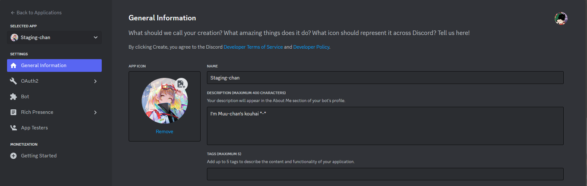
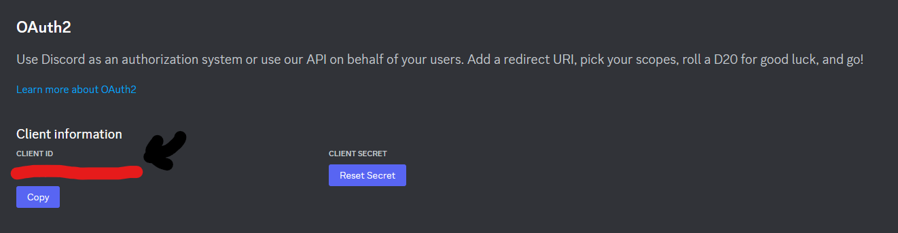
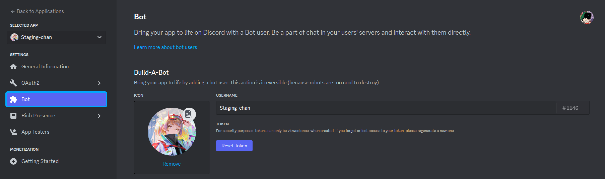
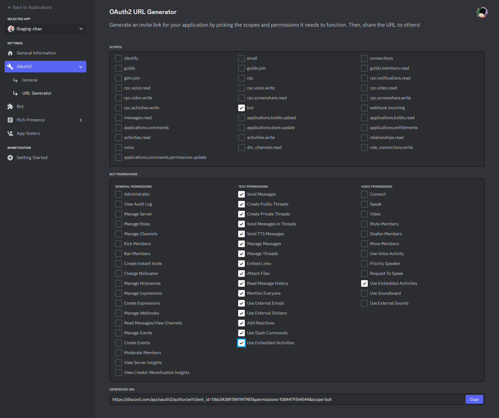
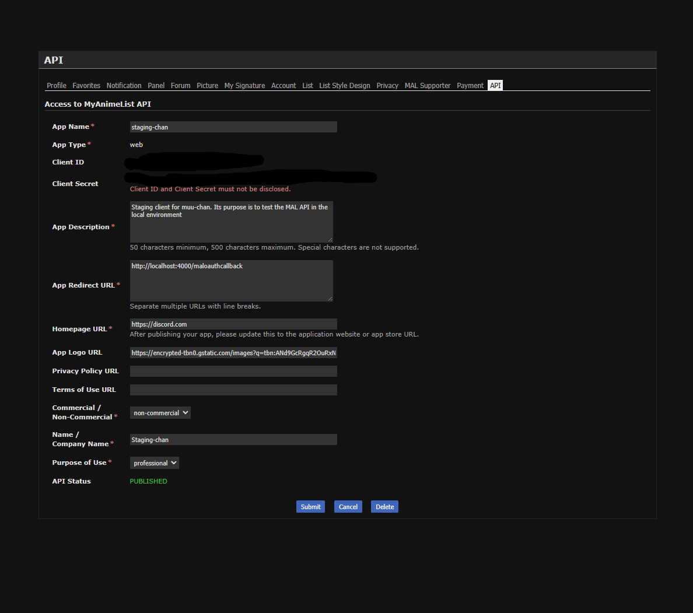

<div align="center">
    <h1>Muu-chan</h1>
    
    <p>A kawaii bot to do everything your imagination can think of uwu.</p>
</div>

## Running locally

### Setting up Discord

To run muu-chan locally, first, you'll need a Discord bot. Please go to the [Discord Developer Portal](https://discord.com/developers/applications) and
click "New Application". Give it a good name, as it will be the name of the bot.

The page will look like the following image. Customize the details of your bot now:



Go to the "OAuth" page, copy the client id:



Go to the .env.example, copy the client id to the right of the "=" sign on `DISCORD_CLIENT_ID=`. The final configuration will look somewhat like this: `DISCORD_CLIENT_ID=0000-0000-0000-00000`.

Now go to the "Bot" section, click on the "Reset Token" button and copy its contents:



Go to the .env.example, copy the client id to the right of the "=" sign on `DISCORD_BOT_TOKEN=`. The final configuration will look somewhat like this: `DISCORD_BOT_TOKEN=0000-0000-0000-00000`.

Now, invite the bot to the Dawn Cattle server by going into the OAuth -> URL generator page and selecting the following permissions:



Copy the generated URL and paste it into the browser. You'll then invite the bot to the server. Please assign it the same role as you have, if possible.

### Setting up MyAnimeList!

We also need a client to use the MyAnimeList! API. Go into the [developer page](https://myanimelist.net/apiconfig) and click the small "Create ID" button. Fill the details like the following image, "Client ID" and "Client Secret" will appear later:



You can use any URL as your app logo URL. Click on submit. The Client ID and Client Secret should appear. Copy those values into the equivalent .env.example variables:

```
MAL_CLIENT_ID=0000-0000-0000-0000 # Replace with the ClientId
MAL_CLIENT_SECRET=0000-0000-0000-0000 # Replace with the ClientSecret
```

That's it

### Setting up the .env

Simply create a .env file at the root of the project and copy the contents that are on `.env.example` into it. Save the file, go into src/index.ts and uncomment the following line:

```ts
// For local development, uncomment here
dotenv.config()
```

### Installing dependencies

To install dependencies simply run `npm i`, you'll need Node installed.

### Docker-Compose

To run the local version of the database, cache, and browser service, you'll need Docker. Install Docker Desktop, follow the instructions, then, at the root of the project, run `docker-compose up` on the same directory where the docker-compose.yml file is.

The first time you do it will download the dependencies.

### Running the project

Finally, run the follow command if you're on Linux/Mac:

`npm run build && npm run start`

Or, on Windows:

`npm run build; npm run start`

The server should be running and the bot should be reachable on Discord.

### Debugging and setting breaking points

Debugging is already configured for VsCode with the .vscode folder. Simply press F5 with VsCode open on the project and the debugger will run. Set breakpoints as you wish

### Please collaborate

Please collaborate! Muu-chan is counting on you!

## MyAnimeList Integration

#### myanimelist-login

Initiates the OAuth flow in MyAnimeList to grant permissions to read the list to the bot.


#### myanimelist-suggestion

Based on the caller's anime list, gives suggestions for new anime.


## LeetCode Integration

#### leetcode-question

Scrapes the LeetCode website for a medium question of a random tag.


### Daily LeetCode Question

Every day, the bot has a cron job to send a random LeetCode question in all the servers it is added to, as long as it has a "leetcode" text channel.
